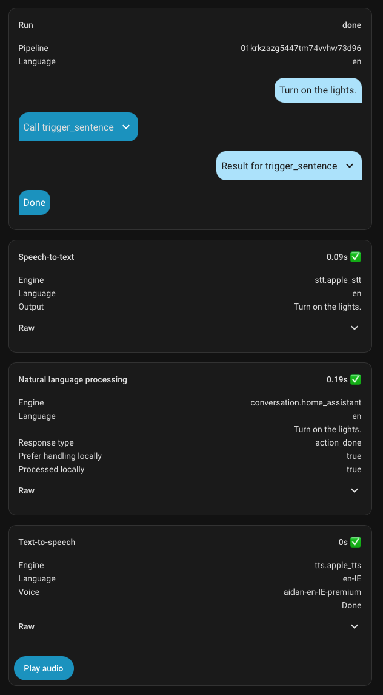
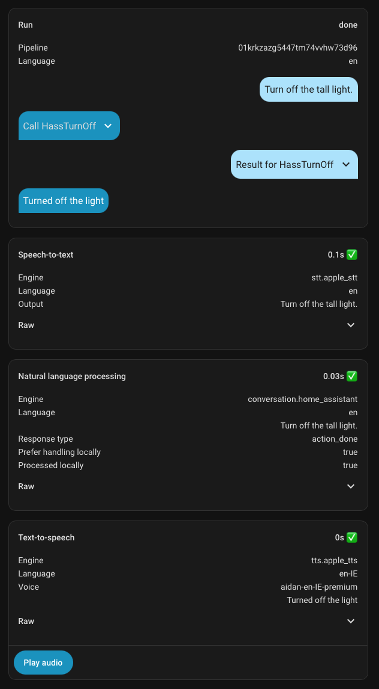
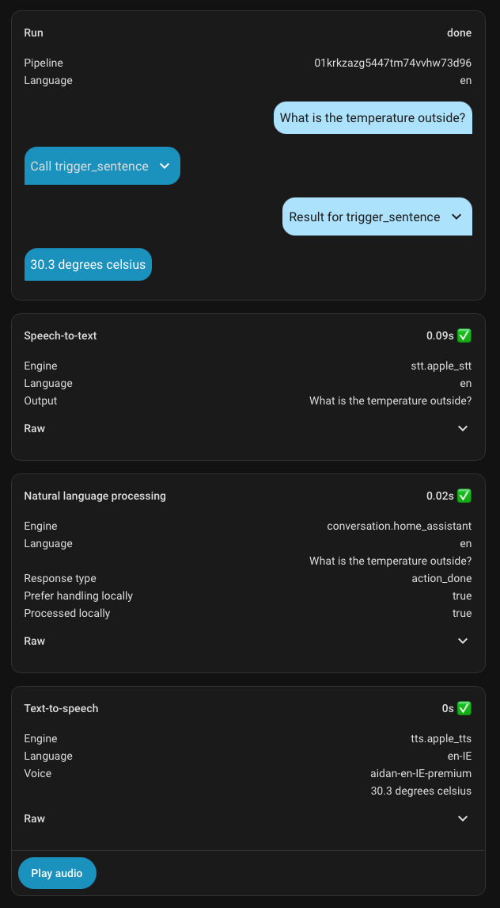
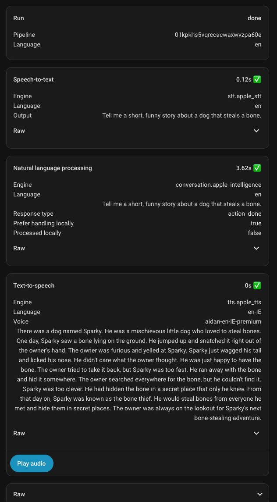

# Wyoming Apple Speech
#### Turn your Mac into a fully private voice engine for Home Assistant — as responsive as Siri on a HomePod or Alexa.
Apple's on-device speech recognition transcribes what you say, and the Mac's own Siri voices
speak the reply. Served over the [Wyoming protocol](https://www.home-assistant.io/integrations/wyoming/).

[](https://github.com/FI-153/wyoming-apple-speech/releases) [](#requirements) [](LICENSE)

- **Assistant-grade responsiveness** — end-to-end voice interactions on par with Siri on
  a HomePod or an Echo: transcription is done the moment you stop talking, and replies
  start speaking in a fraction of a second.
- **Streaming transcription** — words are recognized *while you're still speaking*.
- **Siri text-to-speech** — the Mac's system Siri voices, streamed to Home Assistant
  sentence by sentence, with first audio typically in under 100 ms.
- **100% on-device** — audio and text never leave your Mac.
- **One-command install via homebrew** — a Homebrew service that starts at login and stays out of
  the way.

> [!NOTE]
> You do not need to run Home Assistant on the same Mac where this server is run.


## One-line install

```bash
brew tap FI-153/tap && brew install wyoming-apple-speech && brew services start wyoming-apple-speech
```

*(Coming from the old `wyoming-apple-stt` name? `brew upgrade` migrates your install automatically.)*

Then add a new Wyoming integration in Home Assistant: **Settings → Devices & services → Add integration → Wyoming Protocol**, enter your Mac's IP and port `10300`.

Speech-to-text now works out of the box. MacOS asks for Speech Recognition permission on the first transcription then never again. 
To **enable the Siri voices**, follow the [additional steps](#enable-siri-voices-tts) below.

> [!IMPORTANT]
> For the service to survive a reboot unattended, enable [automatic login](https://support.apple.com/en-us/102316) on the Mac.

## Requirements

Which speech engine you get depends on the macOS version — both run fully on-device:

| macOS | STT engine | Language models |
|---|---|---|
| **26 (Tahoe) or later** | [SpeechAnalyzer](https://developer.apple.com/documentation/speech/speechanalyzer) — faster and more precise | Download on-demand the first time a language is used |
| **15 (Sequoia)** | [SFSpeechRecognizer](https://developer.apple.com/documentation/speech/sfspeechrecognizer) | Uses the dictation locales already installed under **System Settings → General → Language & Region → Dictation** |

## Enable Siri voices (TTS)

The server offers the voices macOS itself manages, because they always match the system's Siri engine. 
To use them:

**1. Download the voices you want.** macOS keeps a *full* voice bundle on disk only for
voices you want to use. In **System Settings → Siri → Siri Voice**, pick the language and select **each
voice slot you want**, letting each finish downloading. Once downloaded, a bundle stays
usable by this server no matter which voice is currently your live Siri voice.

**2. Grant Full Disk Access.** Neural Siri voices load their model cache from
`~/Library/Group Containers/group.com.apple.SiriTTS`, a location macOS protects from
background services — without access, the TTS workers die on startup. 
In **System Settings → Privacy & Security → Full Disk Access**, add the Python that runs the service:

| Install method | Path to add |
|---|---|
| Homebrew | `$(brew --prefix)/opt/python@3.13/Frameworks/Python.framework/Versions/3.13/bin/python3.13` |
| Manual | `~/.local/share/wyoming-apple-speech/venv/bin/python` |

Then restart the service (`brew services restart wyoming-apple-speech`). Re-grant after a Python version upgrade, since the Homebrew path changes.

The voices now appear automatically in Home Assistant's voice picker.

## Examples
|   |   |   |
|:-:|:-:|:-:|
|  |  |  |
|  |

## Configuration

Three settings live in a small config file, read by the service at startup:

| Setting | Default | Meaning |
|---|---|---|
| `PORT` | `10300` | TCP port the server listens on |
| `LANGUAGE` | `en` | Recognition language used when Home Assistant doesn't specify one |
| `EXTRA_ARGS` | *(empty)* | Extra flags passed to the server (see below) |

```bash
# Default location on Apple Silicon:
cat > "$(brew --prefix)/etc/wyoming-apple-speech.conf" <<EOF
PORT=10301
LANGUAGE=it
EXTRA_ARGS="--tts-rate 1.2"
EOF
brew services restart wyoming-apple-speech
```

Useful `EXTRA_ARGS` flags:

| Flag | Default | Meaning |
|---|---|---|
| `--tts-voice <name>` | first discovered voice | Default voice when Home Assistant doesn't pick one |
| `--tts-rate <x>` | `1.0` | Speaking-rate multiplier (also `--tts-pitch`, `--tts-volume`) |
| `--tts-idle-workers <n>` | `1` | Pre-warmed TTS engines kept ready |
| `--no-tts` | off | Disable TTS even when voices are available |
| `--stt-idle-workers <n>` | `1` | Pre-warmed STT workers kept ready |
| `--timeout <s>` | `30` | Max seconds for a single transcription (`--tts-timeout`, default `60`, for synthesis) |
| `--debug` | off | Verbose logging |

Logs live at `$(brew --prefix)/var/log/wyoming-apple-speech.log` (Homebrew) or
`~/Library/Logs/wyoming-apple-speech/` (manual install).

## How it works

**Streaming transcription.** Recognition runs *while you are still speaking*, not
after. Audio chunks are fed to a persistent `apple-stt --worker` process as they arrive
from Home Assistant, partial transcripts stream back as Wyoming `transcript-chunk`
events, and the final transcript is ready within milliseconds of the audio ending.
Workers are pre-warmed: one with a loaded recognition model sits idle at all times, 
and taking it triggers a background replacement spawn, so concurrent utterances never 
wait for model initialization. If the streaming path ever fails, the server transparently
falls back to buffered one-shot transcription of the same utterance to prevent audio loss.

**Streaming synthesis.** Replies start playing as soon as the first samples are
generated, sentence by sentence. A synthesis engine is pre-warmed in an idle `apple-tts` 
worker process at all times: a request starts speaking immediately while a replacement engine 
spins up in the background.

**Concurrency.** Each in-flight synthesis runs in its own worker process, so requests
never queue behind each other. Workers that finish while the pool is already full are 
torn down immediately. Measured on an 8-core Mac mini: 1–80 concurrent requests all completed
without errors at ~55 MB resident memory per active worker, with first audio in under 100 ms up
to roughly as many concurrent requests as physical cores. That comfortably covers one or a handful
of simultaneous voice satellites.

## Troubleshooting 🩺

| Symptom | Cause → fix |
|---|---|
| TTS is silent; Home Assistant logs `invalid start code [0][0][0][0] in RIFF header` | Full Disk Access is missing → [grant it](#enable-siri-voices-tts) and restart the service |
| TTS stopped working after a `brew upgrade` | The Python path changed with the new version → re-grant Full Disk Access to the new path |
| A voice doesn't show up in Home Assistant | Its bundle isn't fully downloaded → select that exact voice slot in System Settings, wait for the download, restart the service. Verify with `apple-tts --list-voices` |
| Nothing transcribes | Speech Recognition permission was denied → allow it under **System Settings → Privacy & Security → Speech Recognition** |
| Server gone after a reboot | The launchd service runs per-user → enable [automatic login](https://support.apple.com/en-us/102316) |
| Anything else | Check the log: `$(brew --prefix)/var/log/wyoming-apple-speech.log`, and add `--debug` to `EXTRA_ARGS` |

## Manual install

If you'd rather run from source without Homebrew:

```bash
git clone https://github.com/FI-153/wyoming-apple-speech.git
cd wyoming-apple-speech
make install           # defaults: PORT=10300 LANGUAGE=en
```

This builds the Swift binaries, creates a Python venv under
`~/.local/share/wyoming-apple-speech`, and installs a launchd service that starts at
login — the same behavior as the Homebrew install. `make uninstall` removes it.

## Uninstall

```bash
brew services stop wyoming-apple-speech
brew uninstall wyoming-apple-speech
```

## Credits
Siri text-to-speech support was contributed by [@DerPicknicker](https://github.com/DerPicknicker).
Generative AI (mostly Claude) has been used to implement code that has been reviewed by humans.
Licensed under the [MIT License](LICENSE).
